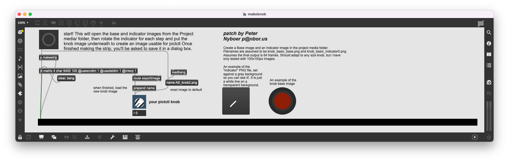

# Simple Knob Strip Maker
A Max Jitter patch that automatically creates images for `pictctl`, based on two images for knob and indicator.

It uses the `srcdim` and `destdim` properties of `jit.matrix` to create the strip of frames from an indicator image file and knob base image file. Only the indicator image is rotated, which makes the final result look nicer, as well as preserve any shading details on the base that you wouldn't want to rotate!

